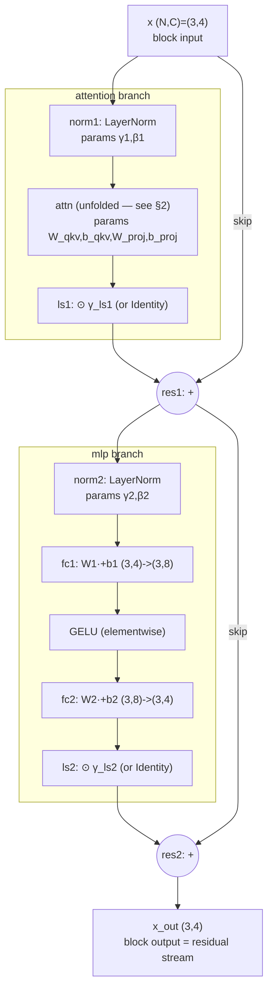
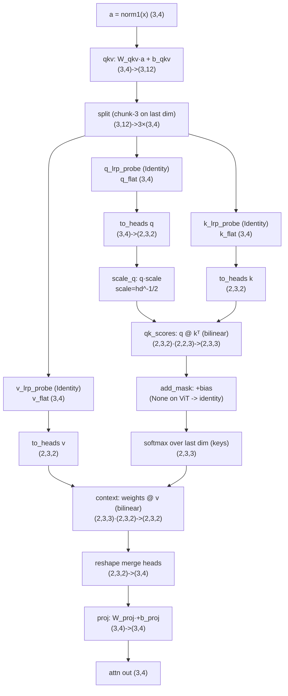

# Transformer block — unfolded computation graph

Authoritative source: `zennit_extensions/attention_unfolded.py` (`TimmAttentionUnfolded`)
+ the block rewire in `zennit_extensions/canonisation/canonizers.py`
(`VanillaViTBlockResidualCanonizer`). Every op below is one of the atomic modules
that file installs. Goal: trace every intermediate number back to the block input
and the model params that touch it.

## Minimized dimensions (for legibility)

| symbol | meaning | value here | real ViT-B |
|---|---|---|---|
| `N` | tokens (incl. cls) | 3 | 197 |
| `C` | embed dim | 4 | 768 |
| `H` | heads | 2 | 12 |
| `hd`| head dim (`C=H·hd`) | 2 | 64 |
| `M` | MLP hidden (`≈4C`) | 8 | 3072 |

Batch `B=1`, dropped from indices. Token index `i,j ∈ {0,1,2}`; channel `c ∈ {0..3}`;
head `h ∈ {0,1}`; head-channel `d ∈ {0,1}`; per-head channel maps to embed channel
`c = h·hd + d`.

## Parameters that live in one block

| param | shape (min) | used by |
|---|---|---|
| `γ1, β1` | (4,) | norm1 (LayerNorm) |
| `W_qkv` | (12, 4) = (3C, C) | qkv projection |
| `b_qkv` | (12,) | qkv projection |
| `W_proj`| (4, 4) = (C, C) | attn output proj |
| `b_proj`| (4,) | attn output proj |
| `γ_ls1` | (4,) *(or Identity)* | LayerScale 1 |
| `γ2, β2`| (4,) | norm2 (LayerNorm) |
| `W1` | (8, 4) = (M, C) | mlp fc1 |
| `b1` | (8,) | mlp fc1 |
| `W2` | (4, 8) = (C, M) | mlp fc2 |
| `b2` | (4,) | mlp fc2 |
| `γ_ls2` | (4,) *(or Identity)* | LayerScale 2 |

`scale = hd^{-1/2}` is a constant, not a param. `q_norm/k_norm` and the post-attn
`norm` are `Identity` on the standard timm ViT path. Dropouts are identity at eval.
Standard timm **ViT-B/16 has no LayerScale** (`ls1=ls2=Identity`); DINOv3/EVA do.

---

## 1. Block-level causal DAG



Two residual adds; the skip edges (`X→res1`, `res1→res2`) carry the identity path —
that is why relevance/gradient can flow input→output without passing through attn/mlp.

Equations:
```
a       = norm1(x)                      # (3,4)
attn    = Attention(a)                  # (3,4)   — §2
branch1 = γ_ls1 ⊙ attn                  # (3,4)   (⊙ broadcast over tokens; Identity on ViT-B)
x1      = x + branch1                    # (3,4)   res1
m       = norm2(x1)                     # (3,4)
mlp     = fc2(GELU(fc1(m)))             # (3,4)
branch2 = γ_ls2 ⊙ mlp                   # (3,4)
x_out   = x1 + branch2                  # (3,4)   res2
```

---

## 2. Attention, fully unfolded



Probe sites `q_lrp_probe / k_lrp_probe / v_lrp_probe` are `Identity` layers on the flat
`(N,C)` tensors — hookable taps, no math. `qk` site = q-probe, `value` site = v-probe.

---

## 3. Single-operation math (indexed, min dims)

Each line is one atomic module; RHS shows exactly which inputs and params combine.

**norm1** (LayerNorm, σ-detached — the `.detach()` on std is for LRP stability):
```
μ_i   = (1/C) Σ_c x[i,c]
σ²_i  = (1/C) Σ_c (x[i,c]-μ_i)²
a[i,c]= (x[i,c]-μ_i) / sqrt(σ²_i+ε)|detach · γ1[c] + β1[c]
```
`a[i,c]` depends on the whole token row `x[i,:]` (via μ,σ) and on `γ1[c],β1[c]`.

**qkv** (Linear, 3C outputs):
```
qkv[i,p] = Σ_c W_qkv[p,c]·a[i,c] + b_qkv[p]      p ∈ 0..11
```
**split** → `q_flat[i,c]=qkv[i,c]`, `k_flat[i,c]=qkv[i,c+4]`, `v_flat[i,c]=qkv[i,c+8]`.

**to_heads**: `q[h,i,d] = q_flat[i, h·hd+d]` (pure reindex; same for k,v).

**scale_q**: `q̃[h,i,d] = q[h,i,d]·scale`.

**qk_scores** (per-head bilinear `q @ kᵀ`):
```
S[h,i,j] = Σ_d q̃[h,i,d]·k[h,j,d]
```
`S[h,i,j]` (query token i attends to key token j, head h) depends on `q_flat[i,·]` and
`k_flat[j,·]` of that head's channels — i.e. on `W_qkv` rows for those channels and `a[i,·],a[j,·]`.

**add_mask**: `S'[h,i,j] = S[h,i,j] + bias[i,j]`; ViT class path `bias=0` → `S'=S`.

**softmax** (over keys j — the only cross-token, nonlinear mixing):
```
w[h,i,j] = exp(S'[h,i,j]) / Σ_{j'} exp(S'[h,i,j'])
```
`w[h,i,:]` depends on the entire key row `S'[h,i,:]` (all tokens).

**context** (per-head bilinear `w @ v`):
```
ctx[h,i,d] = Σ_j w[h,i,j]·v[h,j,d]
```
**reshape**: `o[i,c] = ctx[h,i,d]` with `c=h·hd+d` (merge heads back to (N,C)).

**proj** (Linear):
```
attn[i,c] = Σ_{c'} W_proj[c,c']·o[i,c'] + b_proj[c]
```

**MLP**:
```
m[i,c]   = norm2(x1)[i,c]                              # LayerNorm, params γ2,β2
h1[i,k]  = Σ_c W1[k,c]·m[i,c] + b1[k]        k∈0..7    # fc1
g[i,k]   = GELU(h1[i,k])                                # elementwise nonlinearity
mlp[i,c] = Σ_k W2[c,k]·g[i,k] + b2[c]                   # fc2
```

**residuals**: `x1[i,c] = x[i,c] + γ_ls1[c]·attn[i,c]`,
`x_out[i,c] = x1[i,c] + γ_ls2[c]·mlp[i,c]`.

**embedding (before block 0):** `x0[i,c] = patch_embed(img)[i,c] + pos_embed[i,c]`
(`PosEmbedAdd`); `pos_embed` is a batch-1 constant broadcast over the batch.

---

## 4. Element-level trace — `x_out[0,0]`

Back-substitute one output number to its causes (token 0, channel 0):

```
x_out[0,0] = x1[0,0]                              # skip (identity)
           + γ_ls2[0]·mlp[0,0]                    # mlp branch
x1[0,0]    = x[0,0]                               # skip
           + γ_ls1[0]·attn[0,0]                   # attn branch

attn[0,0]  = Σ_{c'} W_proj[0,c']·o[0,c'] + b_proj[0]
o[0,0]     = ctx[h=0,i=0,d=0]                     # c=0 → h=0,d=0
ctx[0,0,0] = Σ_j w[0,0,j]·v[0,j,0]               # weighted over ALL key tokens j
w[0,0,j]   = softmax_j( S[0,0,:] )               # depends on all keys
S[0,0,j]   = scale · Σ_d q_flat[0, d]·k_flat[j, d]   (head-0 channels)
q_flat[i,d]= Σ_c W_qkv[d, c]·a[i,c] + b_qkv[d]
k_flat[j,d]= Σ_c W_qkv[4+d, c]·a[j,c] + b_qkv[4+d]
a[i,c]     = layernorm(x[i,:])_c · γ1[c] + β1[c]
mlp[0,0]   = Σ_k W2[0,k]·GELU( Σ_c W1[k,c]·norm2(x1)[0,c] + b1[k] )
```

**Causal reading of `x_out[0,0]`:** the skip term is `x[0,0]` verbatim (identity path,
no params). Everything else flows through, in order: `γ2,β2` (norm2) → `W1,b1` → GELU →
`W2,b2` for the MLP term; and `γ1,β1` (norm1) → `W_qkv,b_qkv` → (q·k, softmax over **all
tokens**, then ·v) → `W_proj,b_proj` → `γ_ls1` for the attn term. The **only** places
different tokens mix are the two bilinear matmuls around softmax; everything else is
per-token (channel mixing only). That token-mixing-only-in-attention structure is what
makes the residual stream per-token-addressable for CRP.
